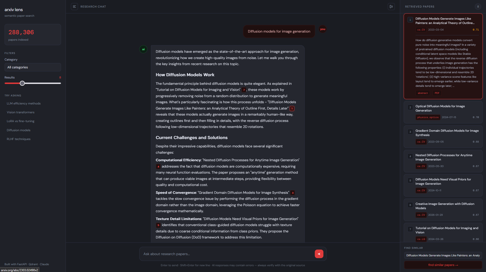

# arXiv RAG


A conversational research assistant for exploring AI and ML literature. Ask anything from broad survey questions to specific technique comparisons and get precise, source-grounded answers from real arxiv papers.

---

## Screenshots

**Research chat with citations**



---

## Features

- **Semantic search** over 288,306 AI, ML, and computer vision papers via Qdrant + OpenAI embeddings
- **Streaming RAG chat** powered by Claude Sonnet 
- **Inline citations** — papers cited as clickable numbered chips that open the source and highlight the corresponding card in the results panel
- **Hover cross-linking** — hovering a citation scrolls the results panel to that paper; hovering a paper card highlights all its mentions in chat
- **Category + result count filters** in the sidebar
- **Find similar papers** — triggers a new semantic search from any retrieved paper
- **Fully dockerized** — one command to run everything

## Stack

| Layer | Technology |
|---|---|
| LLM | Claude Sonnet (`claude-sonnet-4-20250514`) |
| Embeddings | OpenAI `text-embedding-3-small` (1536 dims) |
| Vector DB | Qdrant |
| Backend | FastAPI + Server-Sent Events |
| Frontend | Vanilla JS + marked.js |
| Runtime | Python 3.11.8 |
| Containerization | Docker Compose |

## Project Structure

```
arxiv-rag/
├── api.py                  # FastAPI app — chat, search, recommend, stats endpoints
├── run.py                  # Uvicorn entrypoint
├── Dockerfile
├── docker-compose.yml
├── requirements.txt
├── frontend/
│   ├── index.html
│   ├── main.js             # Streaming, citation injection, hover linking
│   └── styles.css
├── rag/
│   ├── chains.py           # RAG chain — retrieval + Claude call
│   ├── retriever.py        # Qdrant search, recommendations, stats
│   └── prompts.py          # System prompt
└── scripts/
    ├── ingest.py           # Embed and load papers into Qdrant
    └── deduplicate.py      # Deduplicate .jsonl files by paper ID
```

---

## Quickstart

### Prerequisites

- [Docker Desktop](https://www.docker.com/products/docker-desktop/)
- An [Anthropic API key](https://console.anthropic.com/)
- An [OpenAI API key](https://platform.openai.com/) (for embeddings)

### 1. Clone the repo

```bash
git clone https://github.com/yourusername/arxiv-rag.git
cd arxiv-rag
```

### 2. Set up environment variables

```bash
cp .env.example .env
```

Edit `.env`:
```
ANTHROPIC_API_KEY=your_anthropic_key_here
OPENAI_API_KEY=your_openai_key_here
QDRANT_URL=http://qdrant:6333
```

### 3. Restore the Qdrant snapshot

Download the pre-built snapshot (~2.4 GB) with all 288,306 indexed papers:

**[Download snapshot from Google Drive](https://drive.google.com/file/d/1xOWx7w-dIEhv3JQedXij4MFSsfaHicKr/view?usp=drive_link)**

Start Qdrant and restore the snapshot:

```bash
# Start Qdrant
docker compose up qdrant -d

# Restore (Linux / macOS / Git Bash)
curl -X POST "http://localhost:6333/collections/papers/snapshots/upload?collection_name=papers" \
  -H "Content-Type: multipart/form-data" \
  -F "snapshot=@papers-3973220066948834-2026-03-24-00-01-01.snapshot"
```

On Windows (PowerShell):
```powershell
curl.exe -X POST "http://localhost:6333/collections/papers/snapshots/upload?collection_name=papers" `
  -H "Content-Type: multipart/form-data" `
  -F "snapshot=@papers-3973220066948834-2026-03-24-00-01-01.snapshot"
```

### 4. Run the app

```bash
docker compose up --build
```

Open **http://localhost:8000** in your browser.

---

## Building the index from scratch

If you prefer to index your own data instead of using the snapshot:

### 1. Get the dataset

The index was built from the [arxiv AI Research Papers Dataset](https://www.kaggle.com/datasets/umerhaddii/arxiv-ai-research-papers-dataset) on Kaggle. Download the `.jsonl` files and place them in the `data/` directory.

Each line should have the following structure:
```json
{
  "id": "2212.04285v3",
  "title": "...",
  "abstract": "...",
  "authors": ["Author One", "Author Two"],
  "categories": ["cs.LG", "cs.AI"],
  "primary_category": "cs.LG",
  "published": "2022-12-08T00:00:00Z",
  "abs_url": "https://arxiv.org/abs/2212.04285",
  "pdf_url": "https://arxiv.org/pdf/2212.04285"
}
```

### 2. Deduplicate

The original dataset contains over 100,000 duplicate entries across versions. The deduplication script removes them, keeping the latest version of each paper and merging category metadata:

```bash
python scripts/deduplicate.py --data-dir data/ --output data/papers_deduped.jsonl
```

### 3. Ingest into Qdrant

```bash
# Start Qdrant first
docker compose up qdrant -d

# Run ingestion
python scripts/ingest.py --data-dir data/ --reset
```

Ingestion embeds papers using `text-embedding-3-small` in batches of 256 and upserts them into Qdrant. It is resumable — if interrupted, re-run without `--reset` to continue where it left off.

---

## Limitations

- **Date range** — covers papers published between **December 2022 and March 2026** only
- **Categories** — limited to 6 arxiv categories: `cs.LG`, `cs.CV`, `cs.CL`, `cs.AI`, `cs.NE`, `cs.IR` and `stat.ML`
- **No real-time updates** — the index is static and does not pull new papers automatically
- **Abstract only** — papers are indexed by title and abstract, not full text

---

## API Endpoints

| Method | Path | Description |
|---|---|---|
| `GET` | `/` | Serves the frontend |
| `POST` | `/chat` | Streaming RAG chat (SSE) |
| `POST` | `/search` | Pure vector search, returns papers |
| `POST` | `/recommend` | Find similar papers by ID |
| `GET` | `/stats` | Collection stats |

### Chat request body
```json
{
  "message": "What are recent approaches to making LLMs more efficient?",
  "history": [],
  "category": "cs.LG",
  "k": 8
}
```

### SSE event types
```
data: {"type": "papers", "papers": [...]}
data: {"type": "token", "text": "Based on..."}
data: {"type": "done"}
```

---

## Environment Variables

| Variable | Description | Default |
|---|---|---|
| `ANTHROPIC_API_KEY` | Anthropic API key | required |
| `OPENAI_API_KEY` | OpenAI API key (embeddings) | required only for ingestion |
| `QDRANT_URL` | Qdrant connection URL | `http://localhost:6333` |
| `DEBUG` | Enable uvicorn reload | `false` |

---

## Docker

```bash
# Build and start everything
docker compose up --build

# Run in background
docker compose up --build -d

# View logs
docker compose logs -f app

# Stop (data is preserved)
docker compose down
```

---

## Contributing

Contributions are welcome. Some ideas for where to take this further:

- **More categories** — extend the index with `cs.RO`, `cs.CR`, `eess.IV` and others
- **Date range** — pull newer papers and re-ingest to extend coverage beyond March 2026
- **Full-text indexing** — fetch and chunk full PDFs instead of abstracts only
- **Auth layer** — add API key protection before any public deployment
- **Rate limiting** — protect the `/chat` endpoint from abuse

To contribute, fork the repo, create a feature branch, and open a pull request.

---

## Dataset Attribution

The paper data is sourced from the [arxiv AI Research Papers Dataset](https://www.kaggle.com/datasets/umerhaddii/arxiv-ai-research-papers-dataset) on Kaggle.

> If using this dataset in research, please credit arXiv and the original paper authors. All content belongs to the respective authors and is made available by arXiv under its usage policies.

